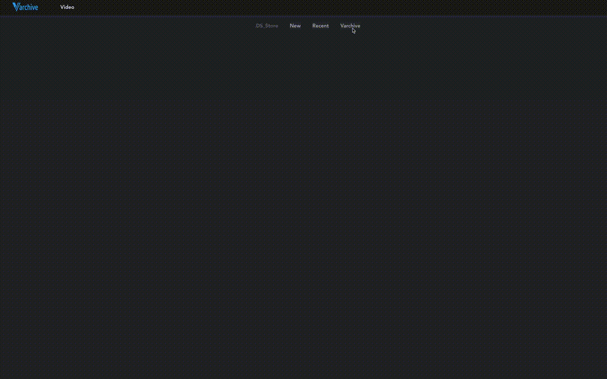
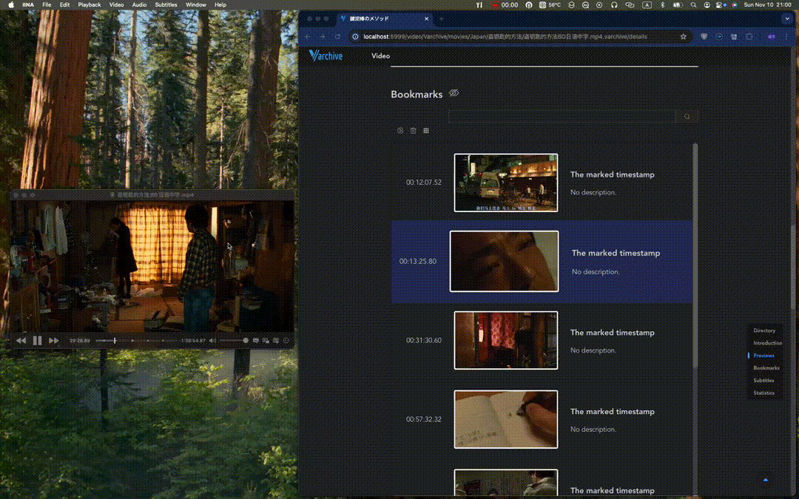
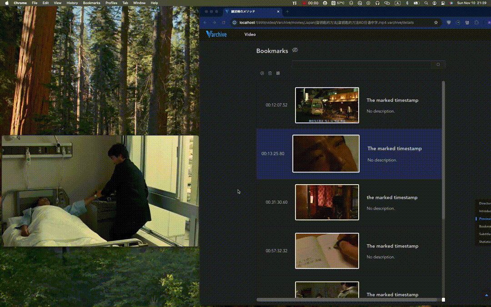
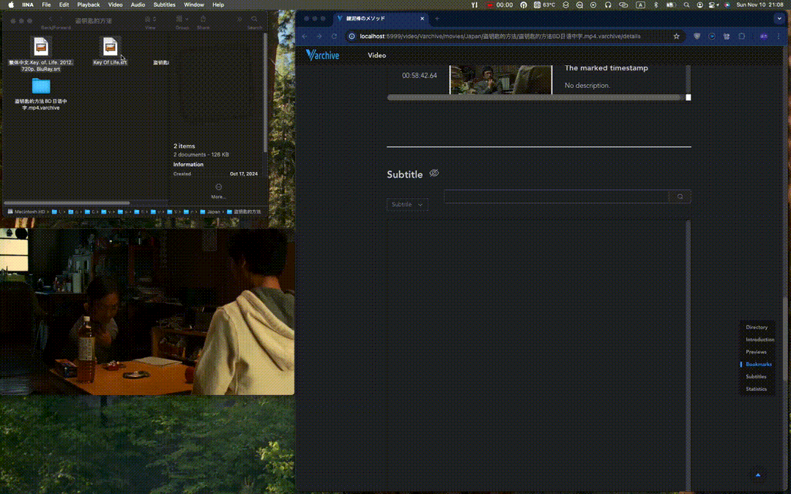
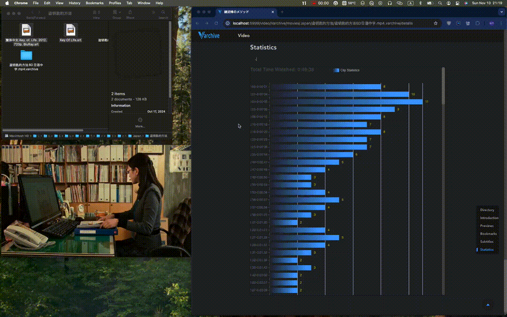

<p align="center">

</p>

## Install

### IINA for Varchive

> Varchive relys on an video player, **[iina-for-varchive](https://github.com/MouJieQin/iina-for-varchive)** forked from the project  [iina](https://github.com/iina/iina)

Download the corresponding version of [release](https://github.com/MouJieQin/iina-for-varchive/releases). 

> Install it but do not open it.  Ensure that iina-for-varchive opens after the varchive server is launched.

Clone this [repository](https://github.com/MouJieQin/varchive.git) by running 
   ```shell
   git clone https://github.com/MouJieQin/varchive.git
   ````
### Install through shell script

```shell
cd varchive
./install.sh
```


> You will be asked to type your system password during the process.
>
> The `install.sh` should be able to install varchive automatically, or you may have to refer to the following steps.

### Install step by step 

#### Varchive Server

1. Install root certificate by running 

   > [!IMPORTANT]
   >
   > The genCA.sh will generate your own root certificate to provide https serve demanded by IINA and Varchive.
   >
   > You will be asked to type your system password during the process.

   ```shell
   cd varchive/server/pem
   ./genCA.sh
   ```

2. Install command line tools used to generate images from video and download video from network resources by running 

   ```shell
   brew install ffmpeg yt-dlp
   ```

3. Launch server

   > The server is developed by python3.9, so python3.9+ shoulde work too.
   >
   > The default config is https://127.0.0.1:8999.

   ```shell
   cd varchive/server/src
   python3 -m pip install -r requirements.txt
   python3 varchive-server.py
   ```

#### Varchive client

   Launch varchive client

   > Open another terminal tab to launch client.
   >
   > The default config is http://localhost:5999/

Install npm first if you don't have 

   ```shell
   brew install npm
   ```

```shell
cd varchive/spa
npm install
npm run dev
```


## Features/Usage

### A simple start

Open a video using [iina-for-varchive](https://github.com/MouJieQin/iina-for-varchive), press `a` key first then press `o` key. A varchive page of this video will be opened on your browser. (Note: you have to use iina defautl key bindings config to do it, or you have to config your key bindings first. )



When you first open the varchive app, you should place a folder you want to archive on the `server/fileManager/video/Varchive/` by running

```shell
ln -s /path/to/folder/you/want/to/archive server/fileManager/video/Varchive/
```

Refresh the app, then you can navigate the folder on Varchive app.

When you open a local video using [iina-for-varchive](https://github.com/MouJieQin/iina-for-varchive) and archive the video by the keyboard shortcut `i`(default key), a varchive link folder will be created in the same directory as the video.  It has the same name as the video, with a `.varchive` postfix. e.g. 

​	Video path: /path/to/your-video.mp4

​	Varchive link folder path: /path/to/your-video.mp4.varchive

You can also archive a network video resources (only support hls format, e.g. `m3u8`). Note: It won't download the entire video.

- The New folder stores new network resources you archived.

- The Recent folder stores the varchive link file of videos you watched recently.

- If you want to open a file when navigation, you can click the empty place of navigation bar where the file you want open is, then move the mouse over it and press the f on your keybord. It will open the file using sysytem default app.









