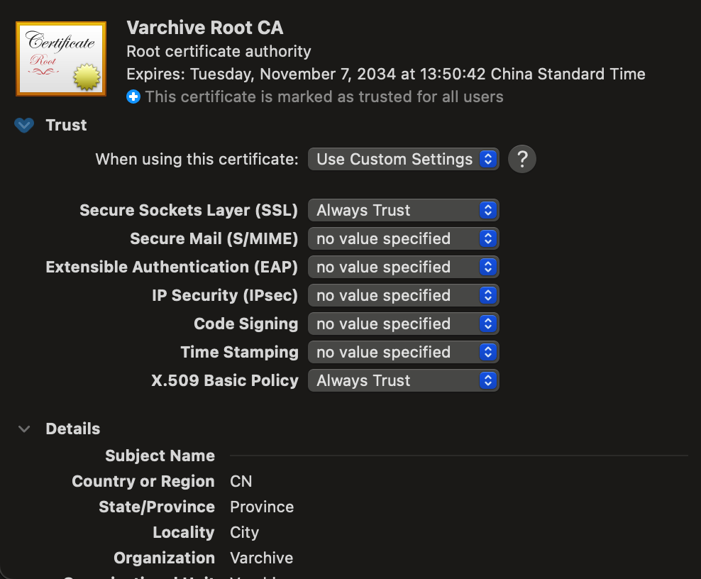

<p align="center">
<p align="center">

</p>


## Running

Clone this [repository](https://github.com/MouJieQin/varchive.git) by running 
   ```shell
   git clone https://github.com/MouJieQin/varchive.git
   ````
#### IINA part

> Varchive relys on an video player, **[iina-for-varchive](https://github.com/MouJieQin/iina-for-varchive)** forked from the project  [iina](https://github.com/iina/iina)

Download the corresponding version of [realease](https://github.com/MouJieQin/iina-for-varchive/releases). 

> Install it but do not open it.  Ensure that inna-for-varchive opens after the varchive server is launched.

#### Varchive Server

1. Install root certificate
> [!Important]
>
> Note: You can generate and install your own root certificate, which can be more safe. 
> You will have to replace the `server/pem/server.crt` and `server/pem/server.key`
> with ones generated from your root certificate if you do so.
> These two files are used to provide https serve demanded by IINA and Varchive.


Open the root certificate by running
```shell
open varchive/server/pem
```
Double click on the file `rootCA.pem`, which will open the KeyChain Access App.

Search `Varchive` in the App if you don't see `Varchive Root CA`.

Double click it and select  `「Always Trust」` for `「Secure Sockets Layer(SSL)」` and `「X.509 Basic Policy」`.

<p align="center"></p>


2. Install command line tools used to generate images from video and download video from network resources by running 

   ```shell
   brew install ffmpeg yt-dlp
   ```

3. Launch server

   > The server is developed by python3.9, so python3.9+ shoulde work too.
   >
   > The default config is https://127.0.0.1:8999.

   ```shell
   cd varchive/server/src
   python3.9 -m pip install -r requirements.txt
   python3.9 varchive-server.py
   ```

   #### Varchive client Part

   Launch varchive client

   > Open another terminal tab to launch client.
   >
   > The default config is http://localhost:5999/

    Install npm first if you don't have 

   ```shell
   brew install npm
   ```

```shell
cd varchive/spa
npm install
npm run dev
```
